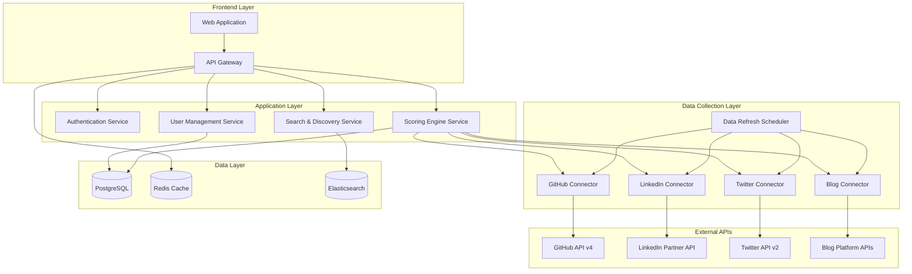

# Design Document: Candidate Scoring Platform

## Overview

The Candidate Scoring Platform is a comprehensive hiring solution that evaluates candidates through their digital presence across multiple platforms. The system aggregates data from GitHub, LinkedIn, Twitter, and blogging platforms to generate objective scores that help recruiters and hiring professionals make informed decisions.

The platform uses a microservices architecture with separate services for data collection, scoring, and user management. It employs machine learning algorithms for scoring and provides both web interface and API access for integration with existing hiring tools.

## Architecture

### High-Level Architecture



### Technology Stack

- **Backend**: Node.js with TypeScript, Express.js
- **Database**: PostgreSQL for primary data, Redis for caching
- **Search**: Elasticsearch for candidate discovery
- **Frontend**: React with TypeScript
- **Authentication**: JWT with OAuth 2.0 for external platforms
- **API**: REST API with GraphQL for complex queries
- **Message Queue**: Redis for background job processing
- **Monitoring**: Application metrics and logging

## Components and Interfaces

### 1. Platform Connectors

#### GitHub Connector
```typescript
interface GitHubConnector {
  fetchUserProfile(username: string): Promise<GitHubProfile>
  fetchRepositories(username: string): Promise<Repository[]>
  fetchContributions(username: string, timeframe: string): Promise<ContributionData>
  calculateCodeQualityMetrics(repositories: Repository[]): Promise<CodeQualityMetrics>
}

interface GitHubProfile {
  username: string
  publicRepos: number
  followers: number
  following: number
  createdAt: Date
  location?: string
  company?: string
}

interface Repository {
  name: string
  description?: string
  language: string
  stars: number
  forks: number
  size: number
  lastUpdated: Date
  isForked: boolean
  topics: string[]
}

interface CodeQualityMetrics {
  languageDiversity: number
  averageRepoSize: number
  commitFrequency: number
  collaborationScore: number
  documentationScore: number
}
```

#### LinkedIn Connector (Partner API Required)
```typescript
interface LinkedInConnector {
  fetchProfile(profileId: string): Promise<LinkedInProfile>
  fetchExperience(profileId: string): Promise<Experience[]>
  fetchSkills(profileId: string): Promise<Skill[]>
}

interface LinkedInProfile {
  id: string
  firstName: string
  lastName: string
  headline?: string
  location?: string
  industry?: string
  connections: number
}

interface Experience {
  title: string
  company: string
  duration: number // in months
  description?: string
  skills: string[]
}
```

#### Blog Connector
```typescript
interface BlogConnector {
  fetchMediumPosts(username: string): Promise<BlogPost[]>
  fetchHashnodePosts(username: string): Promise<BlogPost[]>
  fetchDevToPosts(username: string): Promise<BlogPost[]>
  analyzeContentQuality(posts: BlogPost[]): Promise<ContentMetrics>
}

interface BlogPost {
  title: string
  url: string
  publishedAt: Date
  readTime: number
  claps: number
  views: number
  tags: string[]
  content: string
}

interface ContentMetrics {
  postFrequency: number
  averageReadTime: number
  engagementRate: number
  topicConsistency: number
  technicalDepth: number
}
```

### 2. Scoring Engine

```typescript
interface ScoringEngine {
  calculateCompositeScore(profile: CandidateProfile): Promise<CandidateScore>
  calculateGitHubScore(data: GitHubData): number
  calculateLinkedInScore(data: LinkedInData): number
  calculateBlogScore(data: BlogData): number
  calculateSocialScore(data: SocialData): number
}

interface CandidateScore {
  composite: number // 0-100
  breakdown: {
    github: number
    linkedin: number
    blog: number
    social: number
  }
  strengths: string[]
  improvements: string[]
  lastUpdated: Date
}

interface ScoringWeights {
  github: number // 0.4 (40%)
  linkedin: number // 0.3 (30%)
  blog: number // 0.2 (20%)
  social: number // 0.1 (10%)
}
```

### 3. User Management Service

```typescript
interface UserService {
  createCandidate(data: CandidateRegistration): Promise<Candidate>
  createRecruiter(data: RecruiterRegistration): Promise<Recruiter>
  updateProfile(userId: string, updates: ProfileUpdate): Promise<void>
  deleteAccount(userId: string): Promise<void>
  exportData(userId: string): Promise<UserDataExport>
}

interface Candidate {
  id: string
  email: string
  name: string
  platformConnections: PlatformConnection[]
  score?: CandidateScore
  isPublic: boolean
  createdAt: Date
  updatedAt: Date
}

interface Recruiter {
  id: string
  email: string
  name: string
  company: string
  subscriptionTier: 'basic' | 'premium' | 'enterprise'
  apiKey?: string
  createdAt: Date
}

interface PlatformConnection {
  platform: 'github' | 'linkedin' | 'twitter' | 'medium' | 'hashnode' | 'devto'
  username: string
  isVerified: boolean
  lastSynced?: Date
}
```

### 4. Search and Discovery Service

```typescript
interface SearchService {
  searchCandidates(query: SearchQuery): Promise<SearchResults>
  filterBySkills(skills: string[]): Promise<Candidate[]>
  filterByScore(minScore: number, maxScore: number): Promise<Candidate[]>
  saveSearch(recruiterId: string, query: SearchQuery): Promise<SavedSearch>
  getRecommendations(recruiterId: string): Promise<Candidate[]>
}

interface SearchQuery {
  keywords?: string[]
  skills?: string[]
  minScore?: number
  maxScore?: number
  location?: string
  experience?: string
  languages?: string[]
  sortBy: 'score' | 'relevance' | 'recent'
  limit: number
  offset: number
}

interface SearchResults {
  candidates: CandidateSearchResult[]
  total: number
  facets: SearchFacets
}

interface CandidateSearchResult {
  id: string
  name: string
  score: number
  topSkills: string[]
  location?: string
  githubUsername?: string
  summary: string
}
```

## Data Models

### Database Schema

```sql
-- Users table (both candidates and recruiters)
CREATE TABLE users (
    id UUID PRIMARY KEY DEFAULT gen_random_uuid(),
    email VARCHAR(255) UNIQUE NOT NULL,
    password_hash VARCHAR(255) NOT NULL,
    name VARCHAR(255) NOT NULL,
    user_type VARCHAR(20) NOT NULL CHECK (user_type IN ('candidate', 'recruiter')),
    created_at TIMESTAMP DEFAULT NOW(),
    updated_at TIMESTAMP DEFAULT NOW()
);

-- Candidate profiles
CREATE TABLE candidate_profiles (
    id UUID PRIMARY KEY DEFAULT gen_random_uuid(),
    user_id UUID REFERENCES users(id) ON DELETE CASCADE,
    is_public BOOLEAN DEFAULT false,
    location VARCHAR(255),
    bio TEXT,
    website VARCHAR(255),
    created_at TIMESTAMP DEFAULT NOW(),
    updated_at TIMESTAMP DEFAULT NOW()
);

-- Platform connections
CREATE TABLE platform_connections (
    id UUID PRIMARY KEY DEFAULT gen_random_uuid(),
    candidate_id UUID REFERENCES candidate_profiles(id) ON DELETE CASCADE,
    platform VARCHAR(50) NOT NULL,
    username VARCHAR(255) NOT NULL,
    is_verified BOOLEAN DEFAULT false,
    last_synced TIMESTAMP,
    created_at TIMESTAMP DEFAULT NOW(),
    UNIQUE(candidate_id, platform)
);

-- Candidate scores
CREATE TABLE candidate_scores (
    id UUID PRIMARY KEY DEFAULT gen_random_uuid(),
    candidate_id UUID REFERENCES candidate_profiles(id) ON DELETE CASCADE,
    composite_score INTEGER NOT NULL CHECK (composite_score >= 0 AND composite_score <= 100),
    github_score INTEGER CHECK (github_score >= 0 AND github_score <= 100),
    linkedin_score INTEGER CHECK (linkedin_score >= 0 AND linkedin_score <= 100),
    blog_score INTEGER CHECK (blog_score >= 0 AND blog_score <= 100),
    social_score INTEGER CHECK (social_score >= 0 AND social_score <= 100),
    strengths TEXT[],
    improvements TEXT[],
    created_at TIMESTAMP DEFAULT NOW(),
    updated_at TIMESTAMP DEFAULT NOW()
);

-- Platform data cache
CREATE TABLE platform_data (
    id UUID PRIMARY KEY DEFAULT gen_random_uuid(),
    candidate_id UUID REFERENCES candidate_profiles(id) ON DELETE CASCADE,
    platform VARCHAR(50) NOT NULL,
    data_type VARCHAR(50) NOT NULL,
    raw_data JSONB NOT NULL,
    processed_data JSONB,
    fetched_at TIMESTAMP DEFAULT NOW(),
    expires_at TIMESTAMP,
    INDEX(candidate_id, platform, data_type)
);

-- Recruiter profiles
CREATE TABLE recruiter_profiles (
    id UUID PRIMARY KEY DEFAULT gen_random_uuid(),
    user_id UUID REFERENCES users(id) ON DELETE CASCADE,
    company VARCHAR(255) NOT NULL,
    subscription_tier VARCHAR(20) DEFAULT 'basic',
    api_key VARCHAR(255) UNIQUE,
    api_calls_used INTEGER DEFAULT 0,
    api_calls_limit INTEGER DEFAULT 1000,
    created_at TIMESTAMP DEFAULT NOW(),
    updated_at TIMESTAMP DEFAULT NOW()
);

-- Saved searches
CREATE TABLE saved_searches (
    id UUID PRIMARY KEY DEFAULT gen_random_uuid(),
    recruiter_id UUID REFERENCES recruiter_profiles(id) ON DELETE CASCADE,
    name VARCHAR(255) NOT NULL,
    query_params JSONB NOT NULL,
    created_at TIMESTAMP DEFAULT NOW()
);
```

### Elasticsearch Index Schema

```json
{
  "mappings": {
    "properties": {
      "candidate_id": { "type": "keyword" },
      "name": { "type": "text", "analyzer": "standard" },
      "email": { "type": "keyword" },
      "location": { "type": "text" },
      "bio": { "type": "text" },
      "composite_score": { "type": "integer" },
      "github_score": { "type": "integer" },
      "linkedin_score": { "type": "integer" },
      "blog_score": { "type": "integer" },
      "social_score": { "type": "integer" },
      "skills": { "type": "keyword" },
      "programming_languages": { "type": "keyword" },
      "github_username": { "type": "keyword" },
      "github_repos": { "type": "integer" },
      "github_stars": { "type": "integer" },
      "linkedin_connections": { "type": "integer" },
      "blog_posts_count": { "type": "integer" },
      "years_experience": { "type": "integer" },
      "last_active": { "type": "date" },
      "created_at": { "type": "date" },
      "updated_at": { "type": "date" }
    }
  }
}
```

Now I need to use the prework tool to analyze the acceptance criteria before writing the correctness properties:

<function_calls>
<invoke name="prework">
<parameter name="featureName">candidate-scoring-platform

## Correctness Properties

*A property is a characteristic or behavior that should hold true across all valid executions of a system-essentially, a formal statement about what the system should do. Properties serve as the bridge between human-readable specifications and machine-verifiable correctness guarantees.*

### Property Reflection

After analyzing all acceptance criteria, I identified several areas where properties can be consolidated:
- Platform data fetching properties (1.1-1.4) can be combined into a general data connector property
- Scoring properties (2.1-2.5) can be consolidated into comprehensive scoring validation
- Search and filtering properties (4.1-4.3) can be combined into search result validation
- Profile management properties (3.1, 3.4, 3.5) can be consolidated into profile state management

### Core Properties

**Property 1: Platform Data Retrieval Consistency**
*For any* valid platform connection (GitHub username, LinkedIn profile, Twitter handle, or blog URL), the Platform_Connector should successfully retrieve the expected data types and structure them according to the defined interfaces.
**Validates: Requirements 1.1, 1.2, 1.3, 1.4**

**Property 2: Data Aggregation Completeness**
*For any* candidate with multiple platform connections, the system should aggregate all available platform data into a unified Digital_Profile containing all non-null data from each connected platform.
**Validates: Requirements 1.5**

**Property 3: Scoring Algorithm Consistency**
*For any* set of platform data, the Scoring_Engine should produce a composite score between 0-100 where the breakdown scores sum appropriately according to the defined weights, and identical input data should always produce identical scores.
**Validates: Requirements 2.1, 2.2, 2.3, 2.4, 2.5**

**Property 4: Profile Registration and Management**
*For any* valid candidate registration data, the system should create a complete profile with all provided platform connections, and profile visibility changes should immediately affect search discoverability.
**Validates: Requirements 3.1, 3.4, 3.5**

**Property 5: Score Update and Notification**
*For any* candidate profile, when platform data changes trigger a score recalculation, the system should update the score, generate appropriate notifications, and provide improvement suggestions.
**Validates: Requirements 3.2, 3.3**

**Property 6: Search Result Accuracy**
*For any* search query with skills, languages, or score filters, all returned candidates should match the specified criteria, be ranked appropriately, and include all required display information (score, skills, summary metrics).
**Validates: Requirements 4.1, 4.2, 4.3, 4.4**

**Property 7: Saved Search Functionality**
*For any* recruiter, saved searches should persist correctly and generate notifications when new candidates match the saved criteria.
**Validates: Requirements 4.5**

**Property 8: Score Transparency and Reporting**
*For any* candidate score, the system should provide a complete breakdown showing contribution from each platform, generate detailed reports with actionable recommendations, and track historical changes with explanations.
**Validates: Requirements 5.1, 5.2, 5.3, 5.4**

**Property 9: Dispute Process Handling**
*For any* score dispute submitted by a candidate, the system should properly log the dispute, initiate the review process, and maintain audit trails.
**Validates: Requirements 5.5**

**Property 10: Data Lifecycle Management**
*For any* candidate account deletion, the system should remove all associated data within the specified timeframe, and data export requests should return complete user data in a structured format.
**Validates: Requirements 6.3, 6.4**

**Property 11: Audit Trail Completeness**
*For any* data access operation, the system should create appropriate audit log entries that can be retrieved and presented to candidates upon request.
**Validates: Requirements 6.5**

**Property 12: API Functionality and Security**
*For any* API request, the system should properly authenticate and authorize access based on subscription levels, enforce rate limits, and provide accurate usage analytics.
**Validates: Requirements 7.1, 7.2, 7.5**

**Property 13: Webhook Delivery Reliability**
*For any* score update or candidate match event, registered webhooks should receive notifications with complete and accurate event data.
**Validates: Requirements 7.3**

## Error Handling

### Platform API Failures
- **GitHub API Rate Limits**: Implement exponential backoff and queue requests during rate limit periods
- **LinkedIn API Restrictions**: Handle partner API access requirements and fallback to manual data entry
- **Twitter API Changes**: Adapt to API versioning and policy changes with graceful degradation
- **Blog Platform Unavailability**: Cache previous data and retry with configurable intervals

### Data Quality Issues
- **Incomplete Profiles**: Calculate scores with available data and indicate confidence levels
- **Stale Data**: Implement data freshness indicators and automatic refresh scheduling
- **Invalid Platform URLs**: Validate URLs before processing and provide clear error messages
- **Parsing Failures**: Log parsing errors and attempt alternative extraction methods

### Scoring Edge Cases
- **New Candidates**: Provide provisional scores with improvement suggestions
- **Platform Disconnections**: Recalculate scores excluding disconnected platforms
- **Score Volatility**: Implement score smoothing to prevent dramatic fluctuations
- **Zero Activity**: Handle candidates with minimal online presence gracefully

### System Failures
- **Database Connectivity**: Implement connection pooling and automatic failover
- **Search Service Downtime**: Provide cached results and degraded search functionality
- **Authentication Failures**: Clear error messages and account recovery options
- **API Overload**: Circuit breaker patterns and request queuing

## Testing Strategy

### Dual Testing Approach

The system will employ both unit testing and property-based testing to ensure comprehensive coverage:

**Unit Tests** focus on:
- Specific examples of platform data processing
- Edge cases like empty profiles or API failures
- Integration points between services
- Authentication and authorization flows
- Database operations and data integrity

**Property-Based Tests** focus on:
- Universal properties that hold across all inputs
- Scoring algorithm consistency with randomized data
- Search result accuracy with generated queries
- Data aggregation correctness with various platform combinations
- API behavior with different subscription levels and request patterns

### Property-Based Testing Configuration

- **Testing Framework**: fast-check for TypeScript/JavaScript
- **Minimum Iterations**: 100 per property test
- **Test Tagging**: Each property test references its design document property
- **Tag Format**: `Feature: candidate-scoring-platform, Property {number}: {property_text}`

### Testing Environments

1. **Unit Testing Environment**
   - Mock external APIs for consistent testing
   - In-memory database for fast test execution
   - Isolated service testing with dependency injection

2. **Integration Testing Environment**
   - Sandbox APIs where available (GitHub, Twitter)
   - Test database with realistic data volumes
   - End-to-end workflow validation

3. **Property Testing Environment**
   - Randomized data generation for all platform types
   - Stress testing with high-volume candidate data
   - Cross-platform data consistency validation

### Key Testing Scenarios

**Platform Integration Testing**:
- Valid and invalid usernames/URLs for each platform
- API rate limiting and error handling
- Data parsing accuracy across different profile types

**Scoring Algorithm Testing**:
- Score consistency with identical inputs
- Score boundaries (0-100 range validation)
- Weight distribution accuracy in composite scores

**Search and Discovery Testing**:
- Query result accuracy and ranking
- Filter combination effectiveness
- Performance with large candidate datasets

**Security and Privacy Testing**:
- Authentication and authorization enforcement
- Data access logging and audit trail generation
- Account deletion and data export completeness

### Performance Testing

- **Load Testing**: Simulate concurrent users and API requests
- **Stress Testing**: Test system behavior under extreme loads
- **Endurance Testing**: Long-running operations like data refresh cycles
- **Scalability Testing**: Validate horizontal scaling capabilities

The testing strategy ensures that both specific use cases and general system properties are thoroughly validated, providing confidence in the system's correctness and reliability.